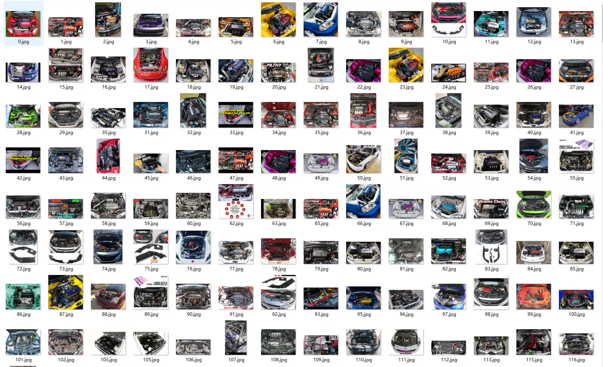
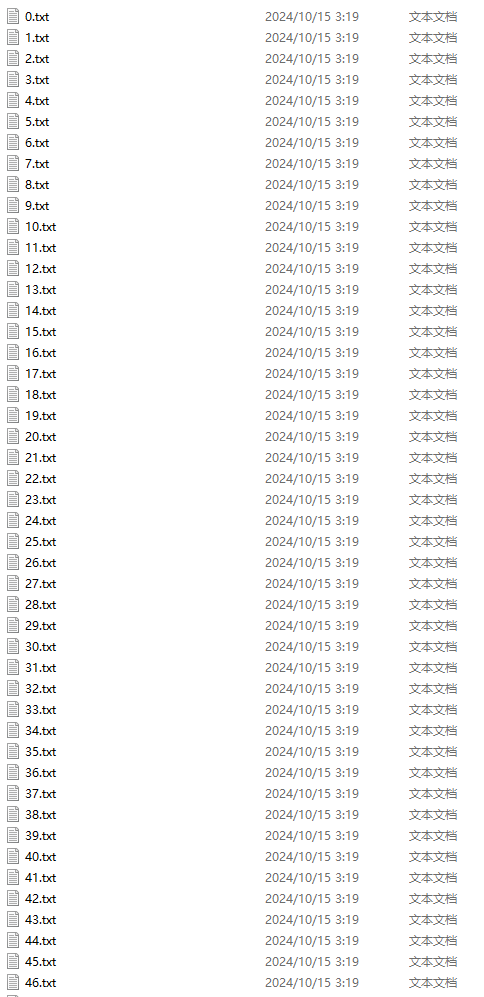
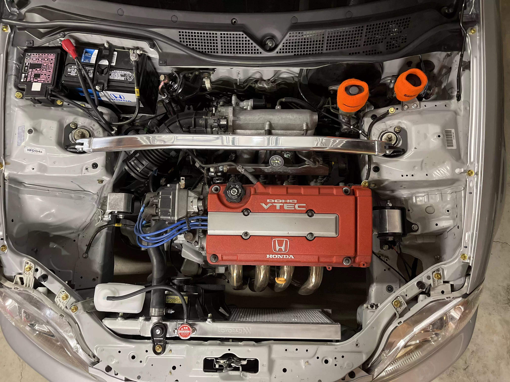
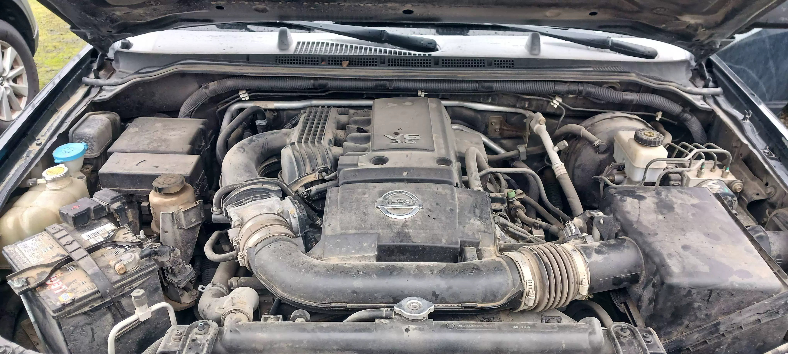
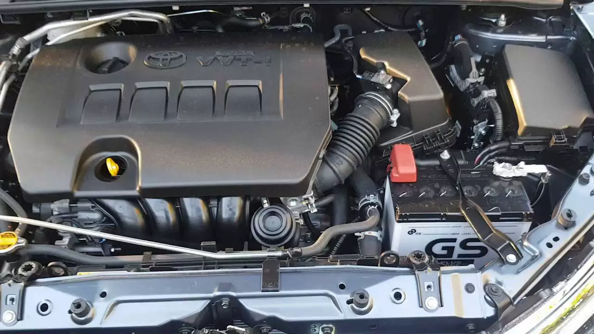
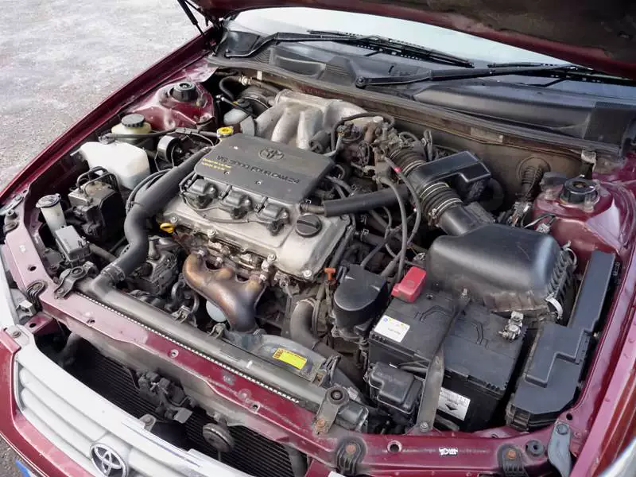

## Body

Car Engine Cabin Image, YOLO Annotation

The dataset consists of two folders. The "images" folder contains 1201 images of different brands, models, and years of car engine cabins. The "labels" folder contains YOLO formatted labels for each part of the engine cabin. The data is clean and the labels are accurate.

The levels are as follows:
0 - Frequency coolant reservoir
1 - Battery
2 - Radiator cap
3 - Windshield wiper oil
4 - Fuse box
5 - Power steering fluid reservoir
6 - Brake fluid
7 - Engine oil filler cap
8 - Engine oil level gauge
9 - Air filter cover
10 - ABS unit
11 - Starter
12 - Engine cooling fluid tank
13 - Radiator
14 - Air filter
15 - Engine cover
16 - Cold air intake
17 - Gearbox oil reservoir
18 - Transmission oil rod
19 - Intercooler cooling fluid tank
20 - Oil filter Hausmannig
21 - ATF oil tank
22 - Driver's side air filter Hausng
23 - Secondary coolant reservoir
24 - Electric motor
25 - Oil filter

Electronic virtual products are not returnable.

## Images

Here is a pay link on Stripe ( https://buy.stripe.com/3cs8yP7sY87d0vu9AB ). Please contact me lonlonago@foxmail.com after funding $89, and I will send you a complete data files , thank you!

